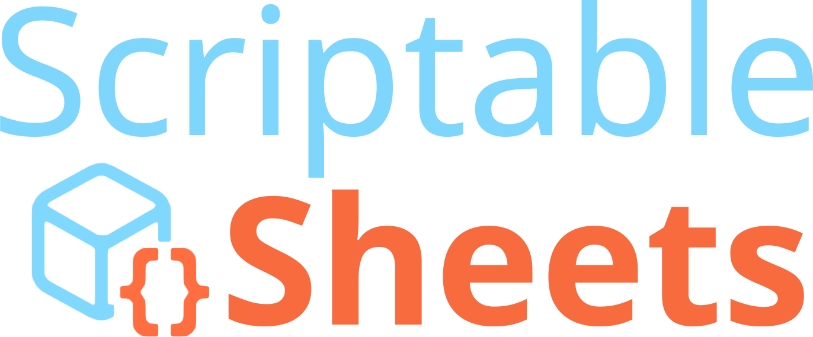
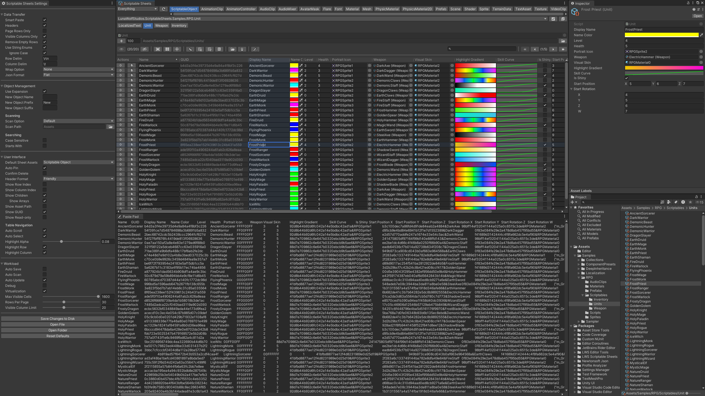

  

This repository contains the latest [changelog](https://github.com/LunaWolfStudios/ScriptableSheetsDocs/blob/main/CHANGELOG.md) and [documentation](https://github.com/LunaWolfStudios/ScriptableSheetsDocs/blob/main/DOCUMENTATION.md) for [Scriptable Sheets](https://assetstore.unity.com/packages/tools/utilities/scriptable-sheets-284559).

[Table of Contents](https://github.com/LunaWolfStudios/ScriptableSheetsDocs/blob/main/DOCUMENTATION.md#table-of-contents)

[Unity's End User License Agreement](https://unity.com/legal/as-terms)

Questions? Email us at [support@lunawolfstudios.com](mailto:support@lunawolfstudios.com)

## Video Tutorials

  
  https://www.youtube.com/playlist?list=PL6G9X1zrT3BLwLA7pbgM5Aam9RrLsrBZp

## Screenshots

  

  

  

